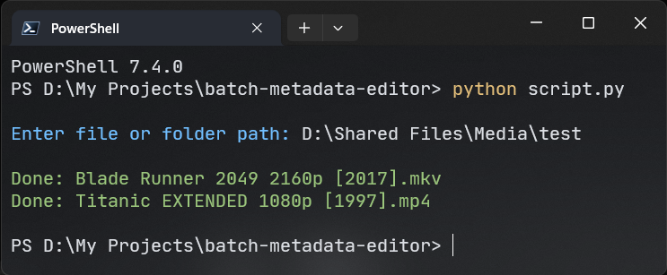
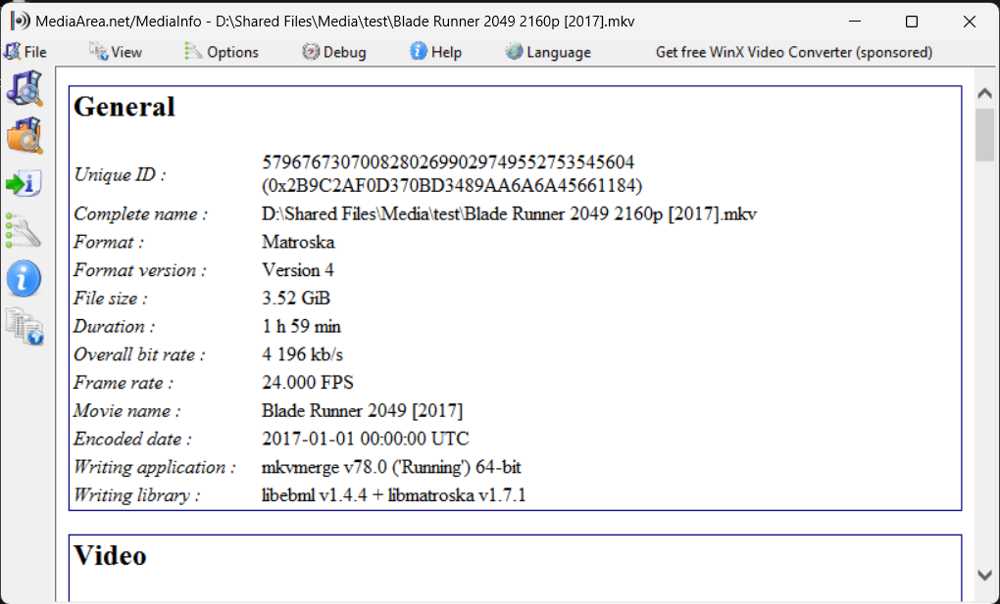
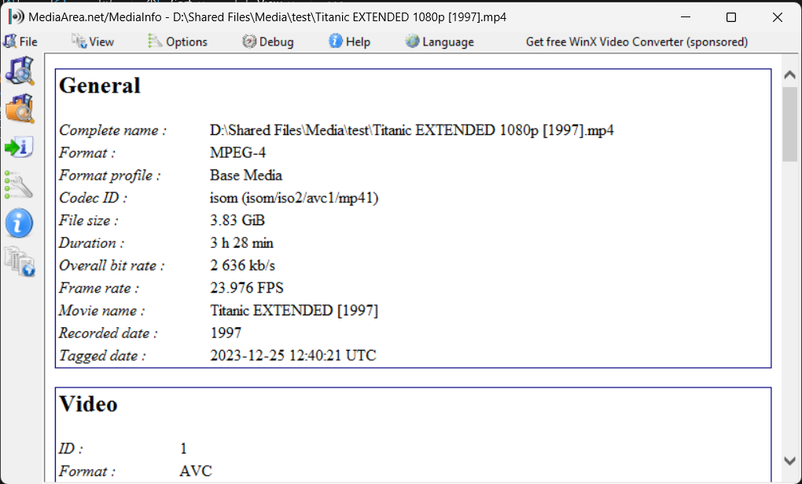

# Batch metadata editor

This python script removes all metadata from mp4 and mkv files and sets the title and year tag from the file name in batch.

**This is a sponsored project by [POPE3909](https://xdaforums.com/m/pope3909.5120701/)**

Need a website, tool, or script that you've always dreamed of having? contact me and I will create it for you.

[u/Raghavan_Rave10](https://www.reddit.com/user/Raghavan_Rave10) (or) Send friend request to `@tetrax10` on Discord, I will get in touch ASAP.

## Video file naming conventions:

1. Blade Runner 2049 2160p [2017]
2. Kill Bill: Vol. 1 720p [2003]
3. Titanic 1080p EXTENDED [1997]
4. Fall 1080p DC [2022]
5. Moby Dick 720p UNRATED [1998]
6. The Good, the Bad and the Ugly 1080p REMASTERED [1966]

## Output:





## Installation

1. Install [python](https://www.python.org/downloads/), make sure "Add python 3.xx to PATH" is checked while installing else it wont work.
2. Download the [latest version](https://github.com/Tetrax-10/batch-metadata-editor/releases/latest) of this script (zip file)
3. Extract the zip and copy the `metadata-editor` folder to `C:\Program Files`
4. Now open start menu and search for `"Edit environment variables for your account"` and click the first result
5. Now select path and click edit, a new tab should open
   </br>
   
6. In that new tab click `new` and paste this path `C:\Program Files\metadata-editor`, click ok, Done 🎉
   </br>
   

## How to run it?

1. Open terminal and run

```sh
python "C:\Program Files\metadata-editor\script.py"
```

2. It will ask for path, so give the file or folder path as the input.
   for **batch metadata editing** give folder path. example: `D:\Media\movies`
   for **single file metadata editing** give video file (mp4 or mkv) path. example: `D:\Media\movies\Oldboy 2160p DC [2003].mkv`

## Credits

1. [MKVToolNix](https://mkvtoolnix.download/) for editing MKV metadata
2. [AtomicParsley](https://github.com/wez/atomicparsley) for editing MP4 metadata
